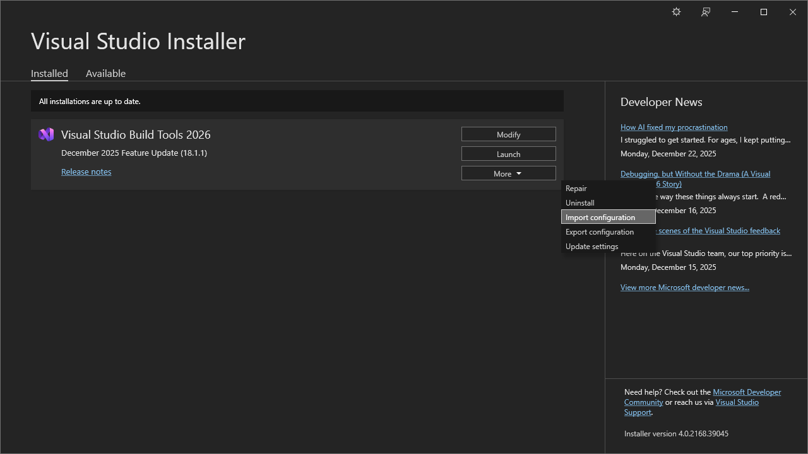

# Learn-C++

---

## Setup Development Environment

1. Install [Visual Studio Build Tools](https://aka.ms/vs/stable/vs_BuildTools.exe)
2. Click **More** → **Import configuration**
3. Select `.vs\.vsconfig` file in project folder
4. Install

